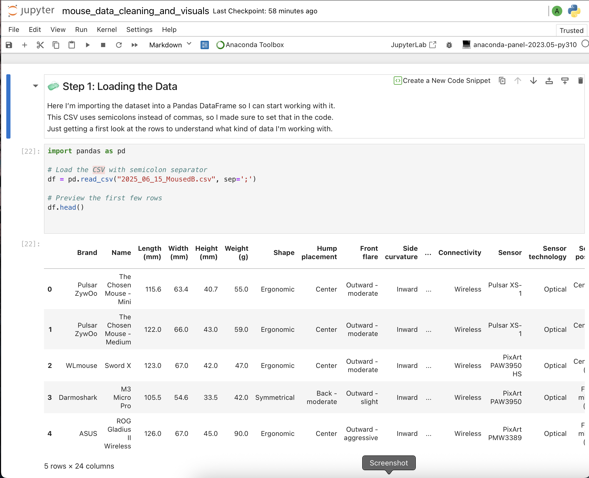

# 🖱️ Mouse Data Analysis (SQL + Python)

Hi! I’m Amelia — a beginner data analyst diving into real-world data using SQL, Python, and visualization tools.  
This project is my way of learning by doing: cleaning messy data, exploring trends, and building insights from scratch.

---

## 🧠 What I Did

- Loaded a raw CSV of gaming mouse specifications (brand, weight, size, shape, and more)
- Cleaned and renamed messy columns for easier analysis
- Converted key features (like weight and dimensions) into numeric format
- Created visualizations to spot trends and patterns using Seaborn + Matplotlib
- Practiced writing SQL-ready data transformations (great prep for query logic!)

---

## 📊 Key Insights

- **Symmetrical mice** were most common in the dataset
- **Width and weight** were the most correlated features (r = 0.63)
- Mouse weights range from **just 19g to over 180g**
- Some brands consistently produce **ultra-light** mice — useful for competitive gamers!

---

## 🔧 Tools Used

- `Python` (Pandas, Seaborn, Matplotlib)
- `Jupyter Notebook`
- Data cleaning and conversion to support **SQL-ready** datasets
- Markdown for documenting each step of the process

---

## 📁 Files

- `mouse_data_cleaning_and_visuals.ipynb` – main notebook with visuals + code
- *(Optional)* `mouse_data_cleaned.csv` – prepped dataset ready for SQL queries
- `images/mouse_sql_thumbnail.png` – screenshot of the notebook preview

---

## 🗒️ Reflections

This was my first time exploring a dataset end-to-end. I learned a ton about:
- How to handle inconsistent columns
- How to turn raw info into real insight
- Why visualizations matter (and what they can reveal!)

I'm excited to keep building, keep learning 🚀

---

Thanks for checking it out!  

